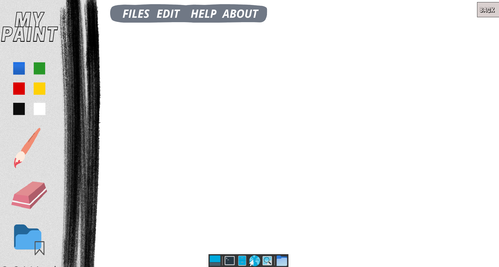

# My Paint

The my_paint is a project realized in C language with the SFML graphic library. It consists in reproducing the software "paint" that we find on our various computers. It has been realized by groups of two in three weeks.

## Installation and usage

To use it, follow the instructions below:
Clone the repository by entering the following command in your terminal:

    git clone git@github.com:Patricklevyy/my_paint.git

Access the cloned folder and compile the project by entering the command:

    make re

Run the program by entering the command:

    ./my_paint

Click on the draw button to begin drawing, select a color from those available, and use the eraser to erase mistakes. To save your design, click the "Save" button and choose the desired file format (.jpeg, .jpg, .png, or .bmp).

## My Paint Screenshot

## Features

Features available in My Paint include:

    Choice of drawing color
    Eraser to erase errors
    Saving drawings in different file formats

## Contact

If you have any questions or comments, you can contact us at: gnanmienlie-patrick-levy.n-da@epitech.eu or bryan.bole@epitech.eu.
